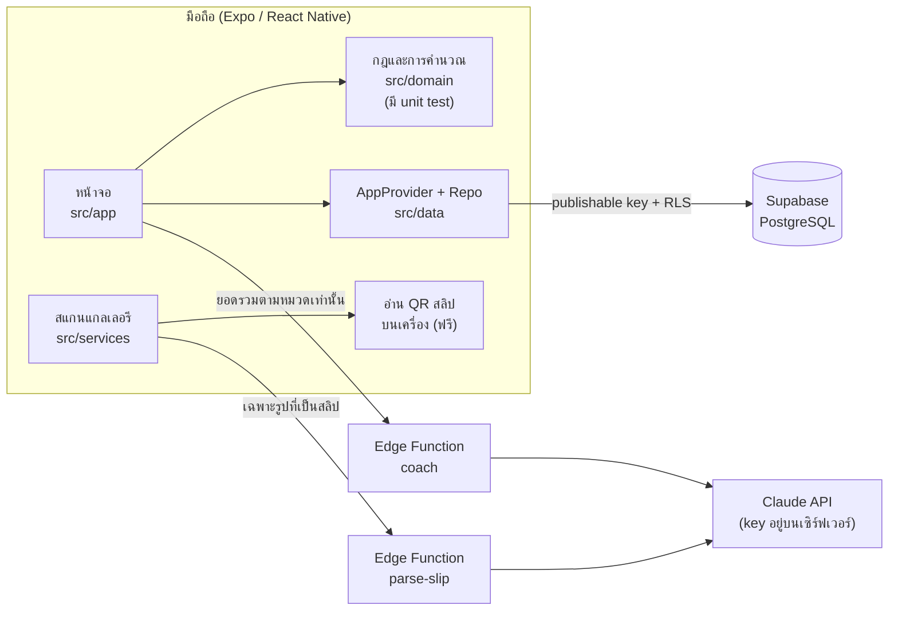

# Mind pay

แอปการเงินส่วนตัวสำหรับนักศึกษาและ First Jobber ที่ไม่ได้แค่ "จดว่าใช้ไปเท่าไร" แต่บอกว่า **เงินที่มีจะพอใช้อีกกี่วัน** และช่วยคิด **ก่อน** จ่าย

รายวิชา Introduction to Software Engineering (15031001) · ทีม 13. Socrates and Skeletons

---

## MVP: 5 Functional Requirements (ตาม M1 Team Charter)

| FR | ฟีเจอร์ | ในแอป |
|---|---|---|
| FR-1 | Transaction Management: เพิ่ม แก้ จัดหมวด ลบ | แท็บ **รายการ**, หน้าจดรายการ |
| FR-2 | Overview Dashboard: รายรับ รายจ่าย ยอดคงเหลือ ยอดตามหมวด | แท็บ **หน้าหลัก** |
| FR-4 | Automatic Gallery Slip Detection: ตรวจสลิปในแกลเลอรี, เกณฑ์ความมั่นใจ 80%, กันรายการซ้ำ | ปุ่มทอง **สแกนสลิป** |
| FR-5 | AI Persona Coach: อธิบายข้อมูลที่ยืนยันแล้วด้วยโทนที่ผู้ใช้เลือก | แท็บ **โค้ช** |
| FR-6 | Money Runway: ประมาณวันที่เงินจะแตะเส้นสำรองจากค่าเฉลี่ย 7 วัน | แท็บ **เงินพอถึง** |

การเชื่อมโยง FR → โค้ด → เทสต์ ทั้งหมดอยู่ใน [`docs/TRACEABILITY.md`](docs/TRACEABILITY.md)

## สถาปัตยกรรม



- **เงินเก็บเป็นสตางค์ (จำนวนเต็ม)** ไม่มีปัญหาทศนิยมเพี้ยน
- **เวลาอิงเวลาไทย (UTC+7)** ทุกจุด ทั้งการจัดกลุ่มรายวันและการอ่านวันที่บนสลิป
- **สลิปที่อ่านได้เป็น "แบบร่าง"** จนกว่าผู้ใช้จะยืนยัน ไม่เข้ายอดเงินก่อน
- **API key ของ Claude อยู่บนเซิร์ฟเวอร์เท่านั้น** แอปไม่มีคีย์ลับ

## โครงสร้างโฟลเดอร์

```
src/
  app/            หน้าจอ (Expo Router: ไฟล์ = หน้า)
    (tabs)/       หน้าหลัก, รายการ, เงินพอถึง, โค้ช
    scan.tsx      FR-4 สแกนสลิป
    transaction.tsx  FR-1 เพิ่ม/แก้/ลบ/ตรวจแบบร่าง
  domain/         กฎทั้งหมด (pure TypeScript ไม่มี UI) + __tests__
  data/           Supabase client, Repo (cloud / demo), AppProvider
  services/       แกลเลอรี, อ่านสลิป, โค้ช
  ui/             Design system: theme, components, charts, ต้นไม้เงิน
supabase/
  migrations/     SQL สร้างตาราง + RLS
  functions/      parse-slip, coach (Deno)
docs/             Traceability, AI usage log
```

---

## เริ่มใช้งาน

### สิ่งที่ต้องมี
- Node.js 22 ขึ้นไป
- มือถือ Android (แนะนำ) หรือ iPhone
- บัญชี Expo (ฟรี) ถ้าจะ build ไฟล์ .apk

### 1. ติดตั้ง

```bash
git clone https://github.com/2550expo-tech/Socrates-and-Skeletons-.git
cd Socrates-and-Skeletons-
npm install
cp .env.example .env
```

ไฟล์ `.env.example` มีค่า Supabase ของโปรเจคทีมใส่ไว้แล้ว (เป็นคีย์สาธารณะ ปลอดภัยที่จะอยู่ในแอป เพราะฐานข้อมูลใช้ RLS กันไว้)

### 2. ทดลองเร็วที่สุด: MindPay (สำหรับทีมพัฒนา)

Expo Go เป็นแอปตัวช่วยตอนเขียนโค้ด แอปของเราจะรันอยู่ข้างใน Expo Go จึงเห็นชื่อ Expo Go บนมือถือ ถ้าต้องการแอป **Mind pay** ที่มีไอคอนและชื่อของตัวเอง ใช้ข้อ 3

1. ลงแอป **Expo Go** จาก Play Store / App Store
2. รัน `npx expo start` แล้วสแกน QR ที่ขึ้นใน terminal ด้วย Expo Go
3. เข้าแอปได้ 2 แบบ: **สมัครสมาชิก** (ใช้ข้อมูลจริงบน Supabase) หรือ **ลองใช้ด้วยข้อมูลตัวอย่าง** (ข้อมูลอยู่ในเครื่อง)

> Android บน Expo Go อาจเข้าถึงแกลเลอรีได้ไม่เต็มที่ตามนโยบายของ Google ถ้าสแกนแกลเลอรีไม่เจอรูป ให้ใช้ปุ่ม "เลือกรูปเอง" หรือ build ไฟล์ .apk ตามข้อ 3

### 3. ติดตั้งเป็นแอป Mind pay จริงบน Android (.apk)

**วิธีง่ายสุด: ดาวน์โหลดไฟล์ที่ build ไว้แล้ว**
ทุกครั้งที่ push ขึ้น `main` GitHub จะ build APK ให้อัตโนมัติ (ไฟล์ `.github/workflows/android-apk.yml`) ใช้เวลาประมาณ 15–25 นาที
เปิดหน้านี้บนมือถือ Android → แตะ `mind-pay.apk` → ติดตั้ง:
https://github.com/2550expo-tech/Socrates-and-Skeletons-/releases/tag/latest-apk

ไฟล์นี้เซ็นด้วย debug key ใช้ทดสอบและพรีเซนต์ได้ แต่ยังไม่ใช่เวอร์ชันลง Play Store

**หรือ build เองผ่าน EAS (บัญชี Expo)**

```bash
npx eas-cli@latest login
npx eas-cli@latest build --profile preview --platform android
```

รอประมาณ 10–20 นาที EAS จะให้ลิงก์ดาวน์โหลด `.apk` เปิดบนมือถือเพื่อติดตั้งได้เลย (ไม่ต้องมีบัญชีนักพัฒนา Google) ได้แอปชื่อ **Mind pay** พร้อมไอคอนต้นไม้เงิน

ไอคอนสร้างจาก `scripts/make_icons.py` ถ้ามีไฟล์โลโก้ทางการของทีม แทนที่ไฟล์ใน `assets/` ได้เลย (icon.png 1024×1024 ไม่มีพื้นใส)

### 4. ตั้งค่า AI (อ่านสลิป + โค้ช)

Supabase Dashboard → **Edge Functions → Secrets** → เพิ่ม

| Name | Value |
|---|---|
| `ANTHROPIC_API_KEY` | คีย์จาก console.anthropic.com (`sk-ant-...`) |

ตัวเลือกเสริม: `SLIP_MODEL`, `COACH_MODEL` (ค่าเริ่มต้น `claude-haiku-4-5-20251001`), `SLIP_DAILY_LIMIT` (300 ใบ/วัน/คน), `COACH_DAILY_LIMIT` (60 ครั้ง/วัน/คน)

ค่าใช้จ่ายโดยประมาณ: อ่านสลิป 1 ใบ ≈ 0.003 ดอลลาร์ (ราว 10 สตางค์)

---

## คำสั่งสำหรับนักพัฒนา

```bash
npm test            # unit test ของกฎทั้งหมด (32 เคส)
npm run typecheck   # ตรวจ TypeScript
npx expo lint       # ESLint
npx expo start      # เปิด dev server
```

## ตั้ง Supabase ใหม่ (ถ้าย้ายโปรเจค)

1. สร้างโปรเจคใหม่ (Region: Singapore)
2. SQL Editor → รันไฟล์ใน `supabase/migrations/` ตามลำดับชื่อไฟล์
3. Deploy ฟังก์ชัน: `npx supabase functions deploy parse-slip` และ `coach`
4. ใส่ Secret `ANTHROPIC_API_KEY`
5. แก้ URL และ publishable key ใน `.env` และ `eas.json`

---

## ความปลอดภัยและความเป็นส่วนตัว

- ทุกตารางเปิด **Row Level Security** ผู้ใช้เห็นและแก้ได้เฉพาะแถวของตัวเอง ตรวจด้วย Supabase Security Advisor แล้ว ผล 0 ปัญหา
- รูปในแกลเลอรีตรวจ **บนมือถือก่อน** เฉพาะรูปที่มี QR ของสลิปธนาคารจึงถูกส่งไปอ่าน และไม่ถูกเก็บไว้บนเซิร์ฟเวอร์
- โค้ช AI ได้รับเฉพาะยอดรวมตามหมวด ไม่มีรูป เลขบัญชี หรือชื่อคน
- จำกัดจำนวนการเรียก AI ต่อวันต่อบัญชี กันค่าใช้จ่ายบานปลาย
- Android ขอเฉพาะสิทธิ์รูปภาพ บล็อกสิทธิ์กล้องและไมโครโฟน

## ข้อจำกัดที่ทราบ

- iPhone: ติดตั้งลงเครื่องจริงแบบถาวรต้องมีบัญชี Apple Developer ระหว่างนี้ใช้ Expo Go ได้
- สลิปที่ไม่มี QR (เช่นบาง e-wallet) จะถูกข้ามในโหมดประหยัด ปิดสวิตช์ "อ่านเฉพาะรูปที่มี QR" หรือใช้ "เลือกรูปเอง"
- ประมาณการ Money Runway ยังไม่รวมรายรับที่จะเข้ามาในอนาคต
- ยังไม่ได้ทดสอบบนมือถือหลายรุ่น ดูแผนทดสอบใน `docs/TRACEABILITY.md`

## การใช้ AI ในการพัฒนา

บันทึกตาม SRS ไว้ที่ [`docs/AI_USAGE_LOG.md`](docs/AI_USAGE_LOG.md)
